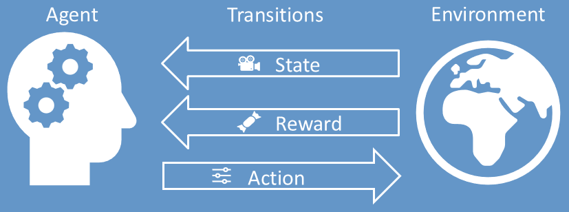
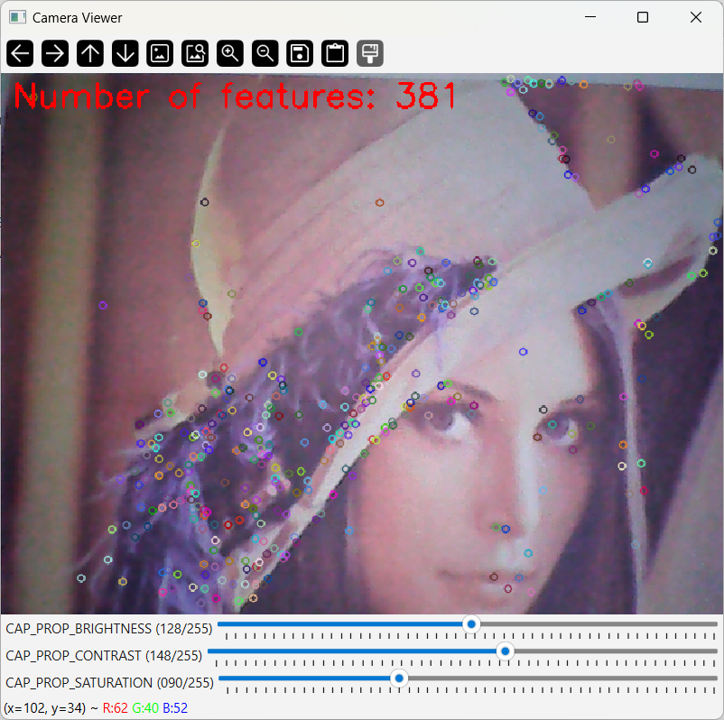

# Camera Settings Controller
**Author**&nbsp;&nbsp;&nbsp;&nbsp;Jonas Gutknecht   
**CAS**&nbsp;&nbsp;&nbsp;&nbsp;&nbsp;&nbsp;&nbsp;&nbsp;&nbsp;Advanced Machine Learning and Machine Learning Operations  
**Module**&nbsp;&nbsp;&nbsp;Reinforcement Learning  
**Date**&nbsp;&nbsp;&nbsp;&nbsp;&nbsp;&nbsp;&nbsp;&nbsp;December 24, 2024  

This repository contains the implementation of a Camera Settings Controller using Reinforcement Learning (RL).

## Overview

### Table of Contents

1. [Overview](#overview)
    - [Table of Contents](#table-of-contents)
    - [Repository Contents](#repository-contents)
2. [Reinforcement Learning Method](#reinforcement-learning-method)
    - [Agent](#agent)
    - [Environment](#environment)
    - [State](#state)
    - [Action](#action)
    - [Reward](#reward)
3. [Results](#results)
4. [Getting Started](#getting-started)

### Repository Contents
| Directory | File              | Description                                                   |
|-----------|-------------------|---------------------------------------------------------------|
| `config/` |                   | Collection of configuration files                             |
| `src/`    | `agent.py`        | Implementation of the RL agent.                               |
|           | `camera_viewer.py`| Implementation of the RL environment |
|           | `config.py`       | Implementation of the configuration handling                |
|           | `dqn.py`          | Implementation of the Deep Q-Networks                          |
|           | `memory_buffers.py` | Implementation of the memory buffers used for training |
| `pitch/241206_pitch_cas/`     | `ADML_RL_CameraSettingsController.pptx` | Slides of the pitch |
| `README.md` |                 | Project overview and instructions. |

## RL Setup


### Agent
The RL agent is responsible for adjusting the camera settings to achieve optimal image quality. It learns from interactions with the environment.

- **Deep Q-Network**  
The DQN takes the `state` as input and creates the `action` as output. The Camera image needs to be downsampled from VGA (640x480 px) to 224x224 px. The structure of the network can be found following:

    1. **MobileNetV3 Small (Pretrained)**:
        - **Feature Extractor**: The core of the model is the **MobileNetV3 Small** architecture, a lightweight and efficient convolutional neural network designed for mobile and embedded applications. It is pre-trained on the **ImageNet** dataset.
        - The MobileNetV3 Small network consists of a series of convolutional layers, depthwise separable convolutions, and fully connected layers that extract hierarchical features from input images.
        - The weights of the pretrained MobileNetV3 Small layers are frozen (i.e., set to `requires_grad=False`). This ensures that these layers are not updated during training, preserving the learned feature representations from ImageNet.

    2. **Custom Classifier Layer**:
        - The final fully connected layer of the MobileNetV3 Small classifier (`self.mobilenet.classifier[3]`) is replaced with a new `nn.Linear` layer. This new layer's output size matches the required output size for the specific task, such as the number of possible actions in the DQN setup.
        - The output size corresponds to the **action space** of the reinforcement learning task (i.e., the number of actions the agent can choose from in a given state).

    4. **Sigmoid Activation**:
        - After the custom classifier layer, a **Sigmoid activation** is applied. This activation function outputs values in the range [0, 1], which can be useful for tasks like binary classification or for Q-value prediction where each output represents the expected value for an action.

- **Training**

    1. **Check Memory and sample Batch**:  
    If the agent's memory contains fewer samples than the specified `batch_size`, no learning occurs, and the method returns early. A batch of experiences is sampled from the agent's memory. Each experience consists of a state, action, reward, and next state.

    2. **Compute Current Q Values**:  
    The model (`policy_net`) predicts the current Q-values for the given states in the batch, which represent the expected future rewards for each action taken in those states.

    3. **Compute Target Q Values**:
    For the next states, the `target_net` is used to compute the Q-values, which are then used to calculate the expected future Q-values. These expected values are combined with the rewards using the discount factor `gamma`.

    4. **Calculate Loss**:  
    The Huber loss (Smooth L1 loss) is calculated between the predicted Q-values (`state_action_values`) and the expected Q-values (`expected_state_action_values`).

    5. **Backpropagation and Optimization**:  
    The loss is backpropagated, and the gradients are clipped to prevent large updates. The model’s optimizer then updates the `policy_net`'s weights.

    6. **Soft Update of Target Network**:  
    A soft update is performed on the `target_net` weights using a weighted average of the `policy_net` weights and the current `target_net` weights, controlled by the `tau` factor.  

### Environment
The environment is described in `src/camera_viewer.py` and is splitted into the following classes:

- `Camera`  
This class handles the camera and its configuration. There are methods to get and set the camera parameters and to get a frame and its corresponding SIFT features.

- `UserInterface`  
This class creates an OpenCV window to visualize the camera frame. The camera parameters are visualized as slidebars and its values can be retrieved and set using the get and set methods.

- `CameraViewer`  
This class combines the `Camera` and `UserInterface` class by instancating them. The run method allows to run the camera viewer. The actions are taken by a given agent or by a human user using the userinterface.



### Transitions
- **Action**  
The action space is defined by the selected camera parameters where each parameter is normalized into the range [0,1]. For this project the following camera parameters are used which leads to an action space of dimension 3:
    - `CAP_PROP_BRIGHTNESS`  
    Controls the brightness of the image, adjusting the lightness of the entire scene captured by the camera.
    - `CAP_PROP_CONTRAST`  
    Adjusts the difference between the light and dark areas of the image, affecting the overall sharpness and distinction of features.
    - `CAP_PROP_SATURATION`  
    Modifies the intensity of colors in the image, making them more vivid or more muted.

- **State**  
The state of the enironment is given by the camera RGB image in VGA resolution
- **Reward**  
    The reward is calculated from the SIFT features of the state image. Next to the quantity of the SIFT features, also its quality is used to calculate the reward. From the SIFT features, following values are retrieved:
    $$ N_{kp} : \text{Number of keypoints} $$
    $$ r_{i} : \text{Response value of keypoint i} $$

    Given these values, the reward can be calculated using this function:
    $$ N_{kp\_max} = 500 $$ 
    $$ \alpha = 0.3 $$
    $$ reward =  \frac{\alpha N_{kp}}{N_{kp\_max}} + \frac{(1-\alpha)}{N_{kp}}\sum_{i=0}^{N_{kp}-1} r_{i}$$


## Results

The RL agent successfully learns to adjust the camera settings to optimize image quality. The results are stored in the `results/` directory, including performance metrics and visualizations of the agent's performance over time.

## Getting Started

To get started with the Camera Settings Controller project, follow these steps:

1. Clone the repository:
    ```bash
    git clone https://github.com/yourusername/CameraSettingsController.git
    cd CameraSettingsController
    ```

2. Create and activate the conda environment
    ```bash
    conda env create -f environment.yaml
    conda activate envRL
    ```

3. Run the code
    - Train the agent
        1. start the mlflow server
        ```bash
        mlflow server
        ```
        2. adjust the configuration according to your needs

        3. start the training
        ```bash
        python main.py -c config/241129_config.yaml -t
        ```

        4. observe the training process using [mlflow](http://127.0.0.1:5000/)

    - Run the agent
        1. Define DQN weights by defining `agent.checkpoint` in the config file. When no checkpoint is given, the user can select the action using the userinterface.

        2. start the agent
        ```bash
        python main.py -c config/241129_config.yaml -r
        ```